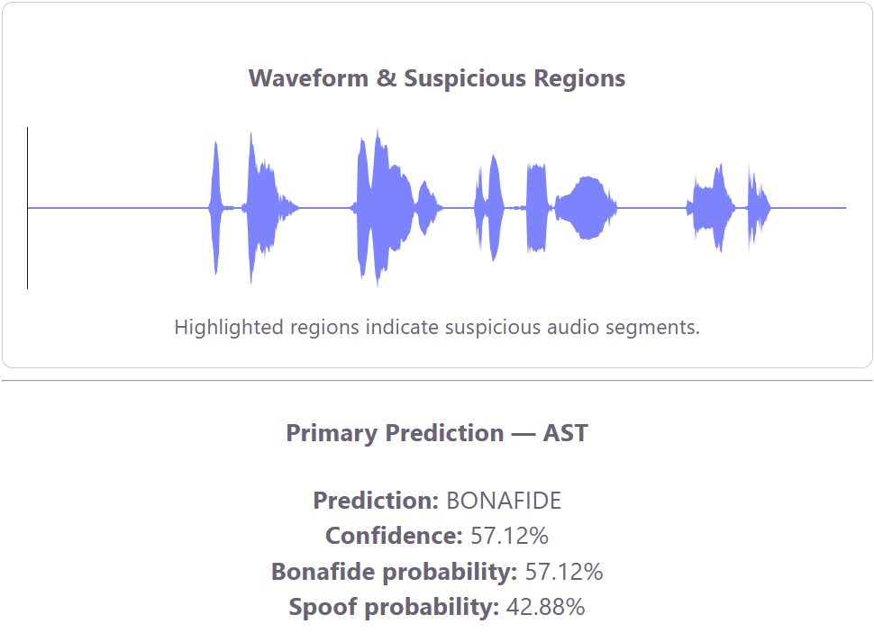
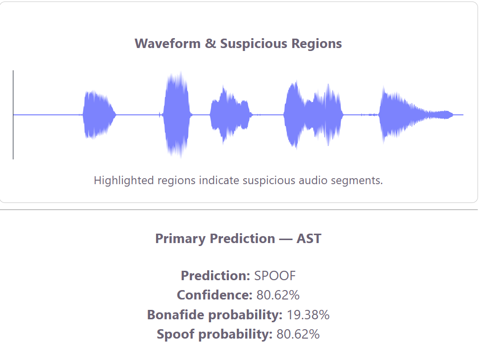
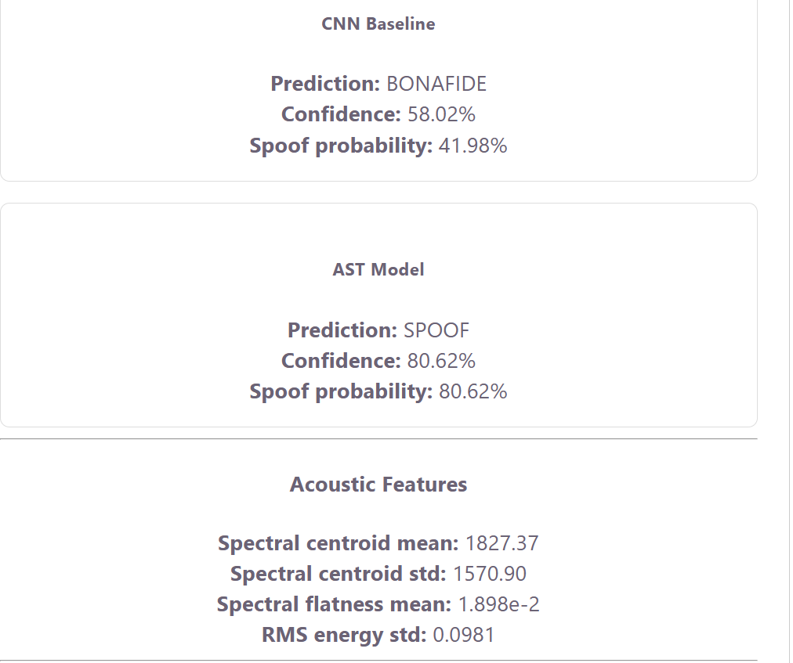
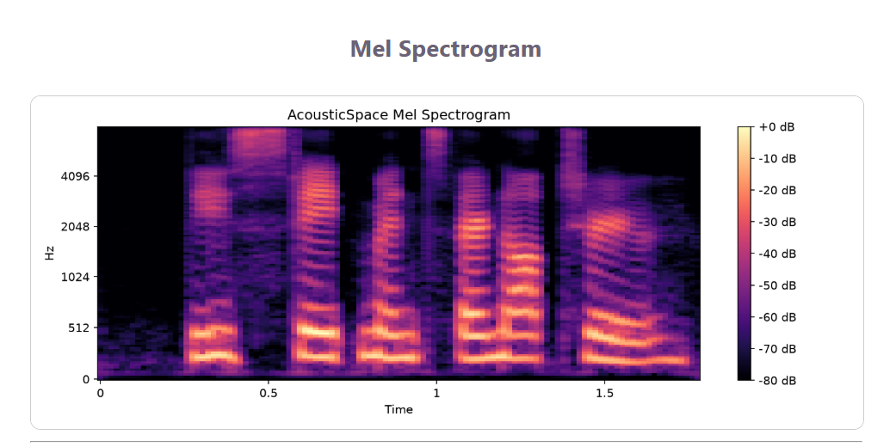

# AcousticSpace — Deepfake Audio Detection via Room Impulse Response (RIR)

AcousticSpace is an end-to-end deepfake audio detection system that combines **acoustic/spectral analysis**, a lightweight **CNN baseline**, and a pretrained **Audio Spectrogram Transformer (AST)** representation model.

The system accepts an audio recording, analyzes its acoustic characteristics, generates waveform and Mel-spectrogram visualizations, compares CNN and AST predictions, highlights suspicious audio segments, and stores previous analysis results.

---

## Screenshots

### Dashboard — Audio Upload


### Genuine Audio Prediction



### Spoof Audio Prediction



### CNN vs AST Comparison



### Mel Spectrogram



---

## Architecture

```text
┌─────────────────────────────────────────────────────────────┐
│               React + TypeScript Frontend                   │
│                 Vite · WaveSurfer.js                        │
│                                                             │
│  Audio Upload → Waveform → Predictions → Spectrogram        │
│                         │                                   │
└─────────────────────────┼───────────────────────────────────┘
                          │
                          │ POST /upload
                          ▼
┌─────────────────────────────────────────────────────────────┐
│                    FastAPI Backend                          │
│                                                             │
│  ┌─────────────────────────────────────────────────────┐    │
│  │               Audio Preprocessing                   │    │
│  │  • Loading using SoundFile                          │    │
│  │  • Resampling                                       │    │
│  │  • Normalization                                    │    │
│  │  • Padding / trimming                               │    │
│  └─────────────────────────────────────────────────────┘    │
│                         │                                   │
│              ┌──────────┴──────────┐                        │
│              │                     │                        │
│              ▼                     ▼                        │
│       CNN Baseline          Pretrained AST Encoder          │
│                                    │                        │
│                                    ▼                        │
│                            768-D Audio Embedding            │
│                                    │                        │
│                                    ▼                        │
│                           Binary Classifier                 │
│                                    │                        │
│              └──────────┬──────────┘                        │
│                         ▼                                   │
│                 Bonafide / Spoof                            │
│                                                             │
│  Acoustic Features · Segment Analysis · Mel Spectrogram     │
└─────────────────────────────────────────────────────────────┘
                          │
                          ▼
                  Persistent History


Project Objective

The goal of AcousticSpace is to classify uploaded speech as:

BONAFIDE — genuine speech
SPOOF — synthetic or manipulated speech

The project explores whether acoustic and spectral characteristics of an audio recording can complement deep-learning-based deepfake detection.

Important: The current implementation extracts acoustic and spectral characteristics related to recording conditions. It does not directly estimate a physical Room Impulse Response (RIR).

Dataset

AcousticSpace uses the ASVspoof 2019 Logical Access (LA) dataset.

The dataset contains:

Genuine bonafide recordings
Spoofed / synthesized speech
Protocol files containing ground-truth labels

During dataset indexing, the project discovered approximately:

122,299 audio files

The model evaluation uses ASVspoof protocol labels to distinguish bonafide and spoof samples.

Detection Pipeline
1. Audio Preprocessing

Audio is prepared before model inference.

CNN preprocessing configuration:

Sample Rate : 16 kHz
Duration    : 4 seconds
Samples     : 64,000

Processing includes:

Audio loading with SoundFile
Resampling when required
Waveform normalization
Fixed-duration padding or trimming
2. Acoustic Feature Extraction

The system calculates acoustic and spectral properties including:

Spectral centroid mean
Spectral centroid standard deviation
Spectral flatness mean
RMS energy standard deviation

These values provide additional information about the spectral characteristics of the recording.

3. CNN Baseline

A lightweight convolutional neural network acts as the baseline classifier.

Output classes:

0 → BONAFIDE
1 → SPOOF

Approximate parameter count:

64,642 parameters

The CNN also powers the segment-level suspicious-region analysis.

4. Audio Spectrogram Transformer

AcousticSpace uses the pretrained Hugging Face model:

MIT/ast-finetuned-audioset-10-10-0.4593

The AST backbone is used as a frozen feature extractor.

Audio
  │
  ▼
Pretrained AST Encoder
  │
  ▼
768-dimensional embedding
  │
  ▼
Trained Binary Classifier
  │
  ▼
BONAFIDE / SPOOF

The pretrained AST backbone is not fully fine-tuned in the current system.

Instead:

AST parameters remain frozen.
Audio is converted into a 768-dimensional representation.
A lightweight binary classifier is trained on those embeddings.

AST is used as the application's primary prediction model.

Model Evaluation

A common evaluation was performed using the same 100 ASVspoof development samples:

50 Bonafide
50 Spoof
CNN Baseline
Metric	Score
Accuracy	65.00%
Precision	61.90%
Recall	78.00%
F1 Score	69.03%

Confusion matrix:

[[26 24]
 [11 39]]
AST-Based Model
Metric	Score
Accuracy	85.00%
Precision	90.70%
Recall	78.00%
F1 Score	83.87%

Confusion matrix:

[[46  4]
 [11 39]]
Comparison

The AST-based approach performed substantially better on the common evaluation set.

                 CNN          AST
Accuracy         65.00%       85.00%
Precision        61.90%       90.70%
Recall           78.00%       78.00%
F1 Score         69.03%       83.87%
False Positives  24           4

The AST-based classifier reduced false-positive predictions from 24 to 4 while maintaining the same recall.

Real Audio Demonstration

Two known ASVspoof samples were tested through the complete Dockerized application.

Genuine Sample

Ground truth:

BONAFIDE

AST prediction:

Prediction : BONAFIDE
Confidence : 57.12%

CNN prediction:

Prediction : BONAFIDE
Confidence : 72.00%

Both models correctly classified the genuine sample.

Spoof Sample

Ground truth:

SPOOF

AST prediction:

Prediction : SPOOF
Confidence : 80.62%

CNN prediction:

Prediction : BONAFIDE
Confidence : 58.02%

The AST model correctly detected the spoofed sample while the CNN baseline misclassified it.

This example illustrates why the AST-based model is used as the primary classifier.

Suspicious Segment Analysis

The system analyzes overlapping sections of the audio using the CNN.

Approximate segment configuration:

Window Size : 1 second
Hop Size    : 0.5 seconds

Segments predicted as suspicious are highlighted on the waveform.

Waveform Visualization

The frontend uses WaveSurfer.js to provide an interactive audio waveform.

It allows the user to visually inspect:

Audio amplitude
Speech regions
Suspicious segments
Overall recording structure
Mel Spectrogram

A Mel spectrogram is generated for each analyzed recording using Librosa and Matplotlib.

The visualization shows how spectral energy changes across time and perceptual frequency.

Backend API

The backend is implemented using FastAPI.

Available endpoints:

GET  /
GET  /health
GET  /history
POST /upload
POST /upload

Uploads and analyzes an audio file.

The endpoint performs:

File storage
Audio preprocessing
Acoustic feature extraction
CNN inference
AST inference
Suspicious segment detection
Mel spectrogram generation
History storage
JSON response generation

Example response structure:

{
  "filename": "demo_spoof.flac",
  "duration_seconds": 1.78,
  "cnn": {
    "label": "bonafide",
    "confidence": 0.5802
  },
  "ast": {
    "label": "spoof",
    "confidence": 0.8062
  },
  "primary_prediction": {
    "label": "spoof",
    "model": "AST"
  },
  "segments": [],
  "spectrogram_path": "/generated/example_mel_spectrogram.png"
}
GET /health

Used to verify that the backend is running.

Expected response:

{
  "status": "ok"
}
GET /history

Returns previous analysis records stored by the backend.

FastAPI Documentation

FastAPI automatically provides Swagger documentation.

When the application is running:

http://127.0.0.1:8000/docs

Frontend

The user interface is built with:

React
TypeScript
Vite
WaveSurfer.js

The dashboard presents:

Audio upload
Filename and duration
Interactive waveform
Suspicious regions
Primary AST prediction
CNN prediction
AST prediction
Confidence values
Bonafide probability
Spoof probability
Acoustic features
Segment analysis
Mel spectrogram
Analysis history
Persistent Analysis History

Each analysis produces a history record.

The history contains information such as:

Filename
Timestamp
Prediction
Confidence
Model

History is exposed using:

GET /history

Docker volumes are used to keep the history available after container restarts.

Technology Stack
Layer	Technologies
Machine Learning	PyTorch, Hugging Face Transformers, Scikit-learn
Audio Processing	Librosa, SoundFile, NumPy, SciPy
Backend	FastAPI, Uvicorn
Frontend	React, TypeScript, Vite
Visualization	WaveSurfer.js, Matplotlib
Deployment	Docker, Docker Compose, Nginx
Development	Git, GitHub, VS Code, PowerShell
Project Structure
AcousticSpace/
│
├── backend/
│   ├── app/
│   │   ├── api/
│   │   │   └── routes/
│   │   ├── ml/
│   │   └── services/
│   │
│   ├── data/
│   │   ├── raw/
│   │   ├── uploads/
│   │   ├── generated/
│   │   └── history/
│   │
│   ├── models/
│   ├── Dockerfile
│   └── requirements.txt
│
├── frontend/
│   ├── src/
│   ├── Dockerfile
│   └── package.json
│
├── screenshots/
│   ├── 01_project_structure/
│   ├── 02_dataset/
│   ├── 03_model_evaluation/
│   ├── 04_backend_api/
│   ├── 05_frontend/
│   ├── 06_docker/
│   ├── 07_git_github/
│
├── docker-compose.yml
├── README.md
└── .gitignore
Running AcousticSpace
Option A — Docker Compose

Docker is the recommended way to run the completed application.

From the repository root:

docker compose build

Start the application:

docker compose up -d

Check the containers:

docker compose ps

Expected services:

acousticspace-backend-1
acousticspace-frontend-1
Application URLs

Frontend:

http://127.0.0.1:5173

Backend:

http://127.0.0.1:8000

Swagger API:

http://127.0.0.1:8000/docs

Health check:

http://127.0.0.1:8000/health

Local Backend Development

From the backend directory:

cd backend

Create a virtual environment if one does not already exist:

python -m venv venv

Activate it:

.\venv\Scripts\Activate.ps1

Install dependencies:

pip install -r requirements.txt

Start FastAPI:

uvicorn app.main:app --reload --port 8000
Local Frontend Development

From the frontend directory:

cd frontend
npm install
npm run dev

The Vite frontend can then be accessed using the URL shown in the terminal.

Docker Deployment

The application uses two containers:

┌───────────────────────────┐
│        Frontend           │
│ React production build    │
│ served through Nginx      │
│ Port: 5173                │
└─────────────┬─────────────┘
              │
              ▼
┌───────────────────────────┐
│         Backend           │
│ FastAPI + ML inference    │
│ Port: 8000                │
└───────────────────────────┘

Docker Compose coordinates both services.

Important Screenshots
Project Structure

ASVspoof Dataset

CNN vs AST Evaluation

FastAPI Swagger

Genuine Prediction

Spoof Prediction

Model Comparison

Docker

Key Results

The strongest result obtained during the common ASVspoof development-set evaluation was:

AST Accuracy  : 85.00%
AST Precision : 90.70%
AST Recall    : 78.00%
AST F1 Score  : 83.87%

Compared with:

CNN Accuracy  : 65.00%
CNN Precision : 61.90%
CNN Recall    : 78.00%
CNN F1 Score  : 69.03%

This common-set comparison shows that pretrained transformer-based audio representations provided stronger performance than the lightweight CNN baseline for the evaluated samples.

Limitations
Limited Training Scale

The current classifiers were trained using subsets of the available ASVspoof dataset rather than the entire dataset.

Frozen AST Backbone

The AST transformer remains frozen and acts as a feature extractor.

Full fine-tuning could potentially improve classification performance.

Acoustic Analysis vs Physical RIR

The project uses acoustic and spectral characteristics but does not yet perform full physical Room Impulse Response estimation.

Dataset Generalization

Most evaluation was performed using ASVspoof 2019 LA samples.

Performance may differ on audio generated by newer or unseen deepfake systems.

CPU Performance

AST feature extraction can be relatively slow when inference runs entirely on CPU.

Future Improvements

Planned or possible improvements include:

Full AST fine-tuning
Training with more ASVspoof samples
Direct physical RIR estimation
Additional room-acoustic features
Improved segment-level detection
CNN architecture optimization
CNN + AST ensemble prediction
GPU acceleration
ROC-AUC evaluation
Equal Error Rate (EER)
Additional deepfake datasets
Microphone-based live analysis
Authentication
Database-backed history
Cloud deployment
Development Progress

Major milestones completed:

Project scaffolding                ✅
Dataset integration                ✅
Audio preprocessing                ✅
Waveform generation                ✅
Spectrogram generation             ✅
Mel spectrogram generation         ✅
Acoustic feature extraction        ✅
CNN baseline training              ✅
AST feature extraction             ✅
AST binary classifier training     ✅
Model evaluation                   ✅
CNN vs AST comparison              ✅
FastAPI backend                    ✅
React frontend                     ✅
WaveSurfer visualization           ✅
Suspicious segment analysis        ✅
Persistent history                 ✅
Docker backend                     ✅
Docker frontend                    ✅
Docker Compose                     ✅
End-to-end audio analysis          ✅
Real bonafide/spoof demonstration  ✅
Documentation                      ✅
Conclusion

AcousticSpace demonstrates a complete deepfake audio detection workflow that combines audio signal processing, deep learning, web development, and containerized deployment.

The final system integrates:

Audio Processing
       +
Acoustic Features
       +
CNN Baseline
       +
Pretrained AST Representations
       +
Binary Deepfake Classification
       +
Segment-Level Analysis
       +
FastAPI Backend
       +
React Frontend
       +
Docker Deployment

On the same 100-sample ASVspoof development-set comparison, the AST-based approach achieved:

Accuracy  : 85.00%
Precision : 90.70%
Recall    : 78.00%
F1 Score  : 83.87%

while the CNN baseline achieved:

Accuracy  : 65.00%
Precision : 61.90%
Recall    : 78.00%
F1 Score  : 69.03%

The results show that pretrained transformer-based audio representations can provide a strong foundation for deepfake speech detection when combined with a lightweight task-specific classifier.

